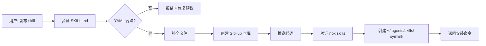

# qiaomu-skill-publisher


> 一键发布 Claude Code Skill 到 GitHub，自动验证、补全文件、创建仓库、推送并验证可安装。

## ✨ 核心特性

- 🚀 **全自动发布**：从验证到推送，一条命令搞定
- 🔍 **严格 YAML 校验**：发布前捕获 SKILL.md 语法错误，避免安装失败
- 📝 **智能补全**：自动生成 LICENSE、README、.gitignore
- ✅ **安装验证**：发布后自动验证 `npx skills add` 可用
- 🔗 **多工具共享**：自动创建 `~/.agents/skills/` symlink，一次发布多工具可用

## 📦 安装

```bash
npx skills add joeseesun/qiaomu-skill-publisher
```

## 📋 前置要求

- [x] Claude Code 已安装
- [ ] GitHub CLI (`gh`) 已安装并登录
  ```bash
  brew install gh
  gh auth login
  ```
- [ ] Python 3.9+ （用于运行发布脚本）
- [ ] Skill 目录包含有效的 `SKILL.md`（含 YAML frontmatter）

## 🚀 快速开始

安装后，在 Claude Code 中用自然语言描述你的需求即可。

### 💡 使用场景

**场景 1：发布新 skill**
```
你说："把 yt-search-download 这个 skill 发布到 GitHub"
AI 做：
  1. 验证 SKILL.md 的 YAML frontmatter
  2. 检查 gh CLI 状态
  3. 自动生成 LICENSE 和 README（如果缺少）
  4. 创建 GitHub 公开仓库
  5. 推送代码并验证可安装
  6. 返回仓库 URL 和安装命令
```

**场景 2：更新已发布的 skill**
```
你说："更新 skill-publisher 的 README"
AI 做：
  1. 检测到仓库已存在
  2. 提交更新并推送
  3. 验证更新成功
```

**场景 3：发布前检查**
```
你说："检查一下这个 skill 能不能发布"
AI 做：
  1. 运行 --dry-run 模式
  2. 验证 YAML 语法
  3. 检查必需文件
  4. 报告潜在问题（不实际发布）
```

## 🏗️ 工作原理



## 📖 详细使用

### 发布流程

当用户要求发布 skill 时，AI 会自动运行：

```bash
python3 ~/.claude/skills/qiaomu-skill-publisher/scripts/publish_skill.py <skill_dir>
```

### 脚本自动完成的步骤

1. **验证** SKILL.md 的 YAML frontmatter（name + description）
2. **检查** gh CLI 就绪状态
3. **创建** LICENSE（MIT，如果缺少）
4. **生成** README.md（从 SKILL.md 提取，如果缺少）
5. **初始化** git（如果需要）
6. **创建** GitHub 公开仓库并推送
7. **验证** `npx skills add` 可发现
8. **创建** `~/.agents/skills/<name>` symlink（多工具共享）

### 参数选项

| 参数 | 说明 |
|------|------|
| `--private` | 创建私有仓库（默认公开） |
| `--dry-run` | 仅检查，不实际发布 |
| `--skip-verify` | 跳过 npx skills 验证 |
| `--github-user USER` | 指定 GitHub 用户名（默认自动获取） |
| `--no-symlink` | 跳过创建 `~/.agents/skills/` symlink |

### 自动创建 ~/.agents/skills/ Symlink

发布成功后，脚本自动在 `~/.agents/skills/<name>` 创建指向 skill 目录的 symlink。

这个目录是通用 Agent Skills 标准目录，以下工具会自动读取：
- OpenCode
- Codex CLI
- Cursor
- Gemini CLI
- GitHub Copilot
- Amp
- Cline
- Warp

**一次发布，多工具共享，无需重复配置。**

## ⚠️ SKILL.md YAML 安全规则

`npx skills` 使用严格 YAML 解析器，以下写法会导致安装失败（报 "No valid skills found"）：

| ❌ 错误写法 | ✅ 正确写法 |
|-----------|-----------|
| `description: 含有 "引号" 的文字` | 改用 `\|` 块标量（见下方） |
| `description: 含单引号'的文字` | 改用 `\|` 块标量 |
| `description: 含冒号: 的文字` | 改用 `\|` 块标量 |

**最安全的 description 写法**：
```yaml
---
name: skill-name
description: |
  描述放这里，可以随意包含 "双引号"、'单引号'、冒号: 等特殊字符
  触发词: 用户说...时触发
---
```

脚本已内置 YAML 严格校验（pyyaml），会在发布前捕获这类错误并给出修复提示。

## 📝 README 质量检查清单

**脚本只在 README 不存在时自动生成一个基础模板**。发布前，必须人工检查/撰写 README，确保它对陌生用户有价值。

### README 必须包含的要素

- [ ] **价值主张**：第一段说清楚能解决什么问题
- [ ] **前置条件清单**：checkbox 格式，每条说明怎么装
- [ ] **完整安装步骤**：编号步骤，每步有验证命令
- [ ] **自然语言使用示例**：2-3 个用户真实会说的句子
- [ ] **致谢原作者**：基于第三方工具时必须注明
- [ ] **风险/限制说明**：写操作、账号、费用相关的风险
- [ ] **常见问题/Troubleshooting**：至少 3 个常见报错和解决方法

## ❓ 常见问题

### Q: 发布失败，提示 "gh: command not found"
**A:** 需要先安装 GitHub CLI：
```bash
brew install gh
gh auth login
```

### Q: YAML 解析错误，提示 "No valid skills found"
**A:** 检查 SKILL.md 的 frontmatter，使用块标量避免特殊字符：
```yaml
description: |
  这里可以随意写 "引号" 和 冒号:
```

### Q: 仓库已存在，如何更新？
**A:** 再次运行同一命令，脚本会自动检测并推送更新：
```bash
python3 ~/.claude/skills/qiaomu-skill-publisher/scripts/publish_skill.py <skill_dir>
```

### Q: 如何发布私有仓库？
**A:** 添加 `--private` 参数：
```bash
python3 ~/.claude/skills/qiaomu-skill-publisher/scripts/publish_skill.py <skill_dir> --private
```

### Q: 验证失败，但仓库已创建怎么办？
**A:** 修复 SKILL.md 后重新运行，脚本会自动更新仓库。或使用 `--skip-verify` 跳过验证。

## 🔒 隐私说明

- **本地处理**：所有文件验证和生成在本地完成
- **外部调用**：仅通过 `gh` CLI 与 GitHub API 交互（创建仓库、推送代码）
- **数据安全**：不上传任何敏感信息，遵循 GitHub 标准权限控制

## 📝 License

MIT

## 📱 关注作者

如果这个项目对你有帮助，欢迎关注我获取更多 AI 工具分享：

- **X (Twitter)**: [@vista8](https://x.com/vista8)
- **微信公众号「向阳乔木推荐看」**:

<p align="center">
  
</p>
